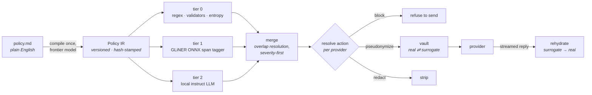

# AI-DLPP — AI Data Leak Prevention Plugin

A browser extension that detects confidential data in LLM prompts **entirely on the user's
machine**, conditioned on a data-leak policy written in plain English, and offers to
pseudonymize or remove it before the prompt is sent — rehydrating the real values in the
model's reply.

This is a **research prototype**. The deliverable is a defensible answer to one question:

> How well can policy-conditioned, fully-local models prevent confidential-data leakage in
> LLM prompts, and at what latency and hardware cost?

A labelled corpus and the evaluation numbers are first-class outputs, not an afterthought.

---

## The core idea: the policy is the program

Most PII tooling ships a fixed taxonomy. This one takes a **natural-language policy document**
— the kind a compliance team actually writes — and compiles it into a versioned, hash-stamped
intermediate representation. That IR then drives every layer at runtime:

- which patterns tier 0 matches,
- **which entity classes the tier-1 model is asked to look for**, injected at inference time,
- which semantic predicates tier 2 judges,
- and what happens to each finding, *per LLM provider*.

Changing the policy changes what the system looks for. **No retraining, no code change.**



**No user prompt ever leaves the browser.** A frontier model is used exactly once — at
policy-compile time, which touches zero user data.

---

## Headline result so far

The tier-1 span tagger runs in a real browser on both WASM and WebGPU. Getting there produced
a finding that matters beyond this project:


`onnxruntime-web`'s WebGPU execution provider **silently returns wrong logits on three of the
four model variants that load at all**. Not slower, not slightly off — a collapse, where every
word scores ≈0.46 and no error is raised. It survives review only because one rung agrees
*exactly* under identical page code, which is what proves the harness is not the cause.

Anyone benchmarking a transformer in the browser on WebGPU should check this before trusting
their numbers.

Two related findings from the same work:


---

## Why the harness runs a real browser

The evaluation harness is Playwright driving actual Chrome, loading the actual detection
package. That is a deliberate and expensive choice.

Numbers measured under `onnxruntime-node` would describe **software nobody runs**, and WebGPU
latency cannot be measured from Node at all. So `apps/eval` may never fork, stub, or
re-implement any detection logic — it reaches detection only through a single page API, and the
WebGPU finding above is exactly the class of defect that a Node-only harness would have
reported as a clean result.

The TypeScript/Python boundary is a **JSONL file**, never a shared library. The harness emits
records; all scoring happens separately in Python. A record carries the findings, the gold
spans, the timings, the resolved config, the IR hash, and the per-item loss counters — enough
that a coverage claim can be re-derived from the file alone.

---

## Repository layout

| Path | What lives there |
|---|---|
| `packages/core` | The detection runtime. Zero DOM, zero Node — lint- and test-enforced, because it runs in both. Policy IR, segmenter, tier-0 rules, merge, action resolution, pseudonymization vault, streaming rehydrator. |
| `packages/compiler` | Policy document → IR. Node-only CLI. The one component allowed to call a frontier model, with an anti-hallucination gate requiring every rule to quote its source clause verbatim. |
| `packages/tier1` | The GLiNER-class ONNX span tagger. Browser-only. Word splitter, per-word encoder, two decoders (the two model families express spans differently), and the span mapper. |
| `apps/eval` | Playwright harness: corpus in, JSONL out. Computes no metrics. |
| `packages/tier2` | The in-browser instruct-LLM judge (`@mlc-ai/web-llm`, WebGPU) behind core's `SemanticJudge` seam, plus **Approach B** — a `Detector` that takes the whole policy document and the whole message in one model call, with no compiler and no tiers. |
| `policies/` | Three deliberately disagreeing policy documents (finance, healthcare, generic corporate) plus the provider manifest. `policies/compiled/` holds compiled artifacts — see the caveat below. |
| `corpora/` | Corpus fixtures and, later, the build pipeline. Never raw third-party data. |
| `docs/superpowers/` | The design spec and the per-plan implementation plans, including their deviation logs. |

---

## Status

Eight plans; four are done.

| | Plan | State |
|---|---|---|
| 1 | Core foundation | **done** |
| 2 | Vault, pseudonymization, rehydration | **done** — Plans 1&nbsp;+&nbsp;2 are `packages/core`, 276 tests between them |
| 3 | Policy compiler + policy suite | **done** offline — 137 tests. The live compile against a frontier model is deferred by choice. |
| 4 | Tier-1 span tagger + eval harness | **done** — `packages/tier1` 219 tests. `apps/eval` is shared with Plan 5 and its count is no longer attributable to one plan. |
| 5 | Tier-2 judge + in-context baseline | **in progress** — `packages/tier2` (255 tests); the compiler-versus-prompting head-to-head runs, see below |
| 6 | Extension (WXT, MV3) | not started |
| 7 | Corpus pipeline | not started |
| 8 | Evaluation and analysis | not started |

**1,259 tests** — 1,180 vitest (core 352, tier2 255, tier1 219, eval 217, compiler 137) plus 79
Playwright specs against real Chrome. Typechecking clean across five projects.

### What is deliberately *not* claimed yet

- **No policy has been compiled by a real frontier model.** Plan 3 is verified against
  hand-authored fixtures, so the *compiler* is tested and the *extraction prompt* is not.
  `policies/compiled/p-fin.ir.json` is real compiler output — every stage ran, and
  `packages/compiler/test/compiled.test.ts` recompiles it on every suite run and requires byte
  equality — but the two model-driven stages were answered from those same hand-authored
  fixtures by `scripts/compile-policies.ts`, which touches no network. Read it as "the
  compiler's output given those responses", never as a frontier model's. `p-med` and `p-corp`
  have no compiled artifact at all: no committed fixture answers their prompts, and the script
  reports that rather than skipping them quietly.
- **The compiler-versus-prompting head-to-head runs, and has produced no verdict.** It is the
  arm that makes the project's central claim falsifiable and for most of Plan 5 it could not
  run at all. It runs now — four arms (compiled judge alone, tier 0 + compiled judge, Approach
  B, B + tier 0) over one compiled policy paired with the document it came from:

  ```
  pnpm -C apps/eval exec playwright test test/baseline.spec.ts
  ```

  What that is *not* is an answer. It is one model over three corpus items, the corpus is the
  smoke fixture whose gold was labelled under a different policy, and **no accuracy metric
  exists anywhere in this repository** — spec 2.2 makes the JSONL file the whole boundary and
  puts scoring in Plan 8. The gate verdicts that run does produce are throughput and hygiene
  properties; `ArmGateReport.scoring.verdictMeans` says so on every row.
- **Approach B fails the p95 time-to-first-token gate, and that is not a result either.** The
  ceiling was derived at the compiled judge's ~1.1 kB prompt, built from one segment; B carries
  the whole policy document on every call and measures 5.4x the prompt tokens. Every report row
  carries `judgedUnit`, `judgedUnitChars` and `promptTokens` so the mismatch is visible rather
  than described, but the gate is still applied and a B-appropriate ceiling would have to be
  derived from a run that has not happened.
- **No accuracy numbers exist.** The corpus in this repo is a 13-item smoke fixture whose only
  job is to prove the pipe carries data end to end. It cannot produce meaningful tier-1
  accuracy in either direction, and says so.
- **The backend axis of the experiment is compromised** by the WebGPU defect above, and is
  reported as a finding rather than quietly dropped.

---

## Evaluation design

Three policies that **disagree on purpose** — client names are forbidden under the finance
policy and explicitly permitted under the healthcare one; salary data is regulated only by the
corporate one; provider-specific clauses appear only in finance. Those disagreements are what
the adaptivity metric grips onto: the same message, scored under three policies, must produce
three different actions.

Carriers are real conversations; only the confidential span is synthetic. **No prompt gets a
label until it is certified clear** under all three policies, so a "negative" is negative by
construction rather than by assumption.

Metrics: leak-prevention rate (headline) paired with over-blocking rate, span P/R/F1 per data
class, a policy-adaptivity delta, utility preservation on pseudonymized prompts, and
latency/footprint per arm and backend.

---

## Running it

```bash
pnpm install
pnpm -r test          # apps/eval drives real Chrome, and tier 2 drives a real GPU
pnpm -r typecheck
```

The tier-1 model weights (1.4 GB across six variants) are **not** in this repository. They are
pinned by content hash — every file each model needs, at an immutable upstream revision — and
fetched on demand:

```bash
pnpm -C packages/tier1 exec vite-node ../../scripts/fetch-models.ts
```

Tests that need weights skip cleanly when they are absent. Tier-2 weights (7.5 GB across four
pinned arms) are fetched by `@mlc-ai/web-llm` into a browser profile outside the repository;
tier-2 specs skip when WebGPU is unavailable, which is *absence*, not degradation.

Compiled policy artifacts are regenerated offline, from the committed model-response fixtures
and with no network call:

```bash
pnpm -C packages/compiler exec vite-node ../../scripts/compile-policies.ts
```

---

## Notes on how this was built

Every implementation task went through an independent spec-compliance review and a code-quality
review, with findings handed to adversarial verifiers who had to reproduce the evidence by
running it before a finding was accepted.

That process repeatedly overturned the plan rather than the code. The tokenizer approach in
Plan 4 was replaced wholesale after measurement showed the library had never shipped the API it
depended on; the decoder design was refuted by running the actual ONNX graphs, whose declared
axis names turned out to be wrong on both model families; a documented justification was found
to rest on a component the pinned checkpoints do not contain.

The recurring defect was rarely broken logic. It was **confident, plausible, wrong output** —
WASM latency labelled WebGPU, a config field recording intent rather than fact, gold values
leaking into the model's own prompt, a crashed browser filing a complete file of errored rows.
Those fail no test. Finding them is the reason the harness runs a real browser.
