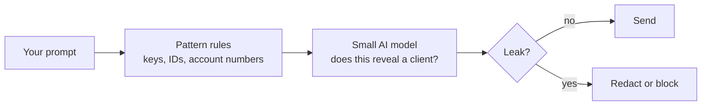
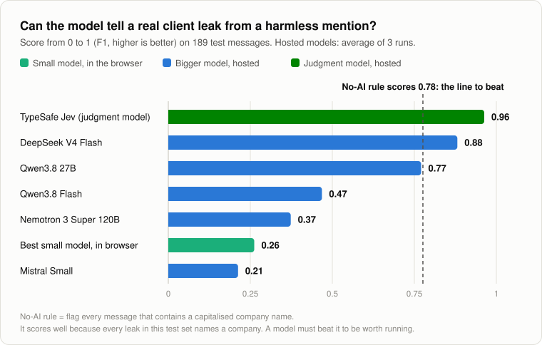
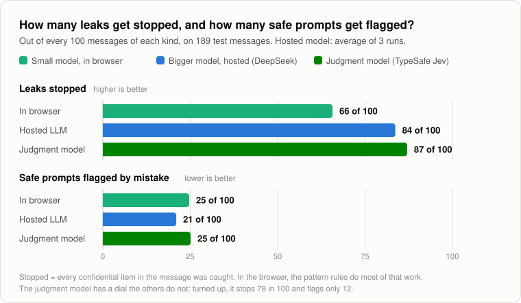

# AI-DLPP · AI Data Leak Prevention Plugin

A browser extension that checks what you paste into ChatGPT, Claude or Gemini **before it is sent**, and strips out confidential data. The check runs **on your own machine**.

**Research prototype.** Full study: [paper, 7 pages](docs/paper/paper.pdf) · [summary, 1 page](docs/paper/executive-summary.pdf)

## The answers

We tested 4 small models inside Chrome and 5 bigger hosted models on 189 realistic work messages, under a bank-style data policy.

**1. Can a small AI model in the browser catch leaks in real time?**
**Partly.** It is fast and free, and its pattern rules catch keys and ID numbers. But it cannot make the policy's judgment calls: it scores worse than a one-line rule with no AI.

**2. Would bigger models do better?**
**Yes, on accuracy.** The best one beats that rule and stops more leaks. But only 1 of the 5 did, and none of them run inside a browser.

<picture>
  <source media="(prefers-color-scheme: dark)" srcset="docs/assets/readme-understanding-dark.svg">
  
</picture>

<picture>
  <source media="(prefers-color-scheme: dark)" srcset="docs/assets/readme-prevention-dark.svg">
  
</picture>

## At a glance

| | Small model, in the browser | Best bigger model, hosted (DeepSeek) |
|---|---|---|
| Understands the policy | ❌ Worse than a no-AI rule | ✅ Beats it (the only 1 of 5 that does) |
| Leaks stopped | ⚠️ 66 in 100 | ✅ 84 in 100 |
| Safe prompts flagged by mistake | ⚠️ 25 in 100 | ⚠️ 21 in 100 |
| Time per message | ✅ About 1 second | ✅ 1 to 2 seconds |
| Cost | ✅ Free | ✅ About $0.04 per 1,000 messages |
| Prompt stays on your machine | ✅ Yes | ❌ No, unless you host the model yourself |

## Bottom line

Keep the in-browser checker for fast, free catching of keys and ID numbers. For judgment calls like "does this message reveal a client?", run a bigger open model on a server you control.

---

[Paper](docs/paper/paper.pdf) · [One-page summary](docs/paper/executive-summary.pdf) · [Research records](docs/research/) · [Technical notes and how to run it](docs/technical-notes.md)

All test data here is synthetic. Every key, ID number, name, email and policy document was written or generated for the study.
