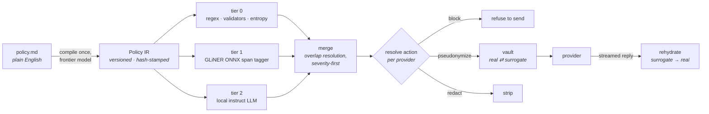
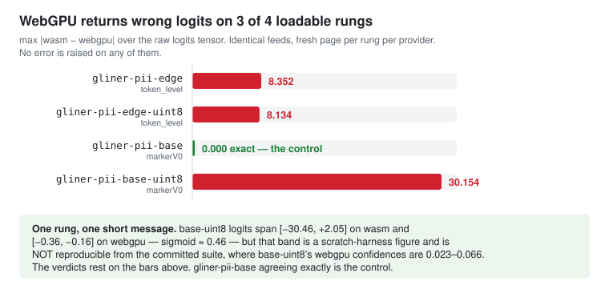
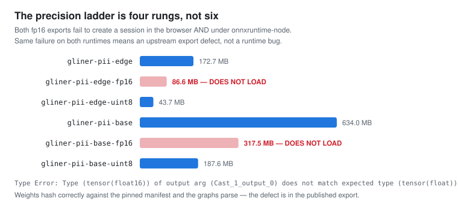
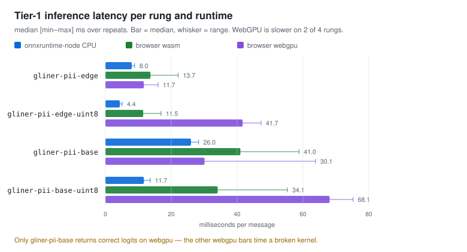

# AI-DLPP — AI Data Leak Prevention Plugin

A browser extension that detects confidential data in LLM prompts **entirely on the user's
machine**, conditioned on a data-leak policy written in plain English, and offers to
pseudonymize or remove it before the prompt is sent — rehydrating the real values in the
model's reply.

This is a **research prototype**. The deliverable is a defensible answer to one question:

> How well can policy-conditioned, fully-local models prevent confidential-data leakage in
> LLM prompts, and at what latency and hardware cost?

A labelled corpus and the evaluation numbers are first-class outputs, not an afterthought.

---

## The core idea: the policy is the program

Most PII tooling ships a fixed taxonomy. This one takes a **natural-language policy document**
— the kind a compliance team actually writes — and compiles it into a versioned, hash-stamped
intermediate representation. That IR then drives every layer at runtime:

- which patterns tier 0 matches,
- **which entity classes the tier-1 model is asked to look for**, injected at inference time,
- which semantic predicates tier 2 judges,
- and what happens to each finding, *per LLM provider*.

Changing the policy changes what the system looks for. **No retraining, no code change.**



**No user prompt ever leaves the browser.** A frontier model is used exactly once — at
policy-compile time, which touches zero user data.

---

## Headline result so far

The tier-1 span tagger runs in a real browser on both WASM and WebGPU. Getting there produced
a finding that matters beyond this project:



`onnxruntime-web`'s WebGPU execution provider **silently returns wrong logits on three of the
four model variants that load at all** — by 8.352, 8.134 and 30.154 on the raw logits tensor,
against a fourth rung that agrees to 0.000 under identical page code. (Those four differences
are Plan 4's scratch-harness measurement, pinned as `BACKEND_AGREEMENT` in
`apps/eval/src/driver/main.ts`; nothing in the committed suite re-derives the tensor diff
itself.) What the suite *does* re-run on every pass is the consequence, and it is not subtle:
end to end at the same threshold on the same message, all three rungs return different spans and
different confidences from WASM, and **no error is raised on any of them**.
Session creation succeeds, the run resolves, and the logits are finite and correctly shaped.

*(This paragraph said "different spans, **different labels** and different confidences" until
2026-09-01. The label half is not observable and never was: the divergence cases run under the
default `apps/eval/fixtures/minimal-ir.json`, whose only tier-1 entityType is `client-name`, so
every finding on every rung and both providers carries that one label. Spans and confidences do
differ, on every run.)*

The ≈0.46 figure in the chart is **one rung's**, and reading it as all three would be reading it
wrong: it is `gliner-pii-base-uint8`'s raw logit range collapsing from `[−30.46, +2.05]` on WASM
to `[−0.36, −0.16]` on WebGPU, whose sigmoid is ≈0.46 for every word. That range was taken by a
scratch harness on a short message and is not re-derivable from the committed suite; what the
suite does reproduce, byte-identical across runs, is that each divergent rung goes wrong its own
way — end to end at threshold 0.02, `gliner-pii-edge` scores 0.10–0.20, `gliner-pii-edge-uint8`
0.34–0.48 and `gliner-pii-base-uint8` 0.02–0.07, against three spans apiece on WASM. What makes
the finding survive review is the rung that agrees *exactly* under identical page code, which is
what proves the harness is not the cause.

Anyone benchmarking a transformer in the browser on WebGPU should check this before trusting
their numbers.

Two related findings from the same work:





---

## Why the harness runs a real browser

The evaluation harness is Playwright driving actual Chrome, loading the actual detection
package. That is a deliberate and expensive choice.

Numbers measured under `onnxruntime-node` would describe **software nobody runs**, and WebGPU
latency cannot be measured from Node at all. So `apps/eval` may never fork, stub, or
re-implement any detection logic, and **every number it reports comes from the real packages
running in real Chrome**, reached through the page API in `src/page/main.ts`. The WebGPU
finding above is exactly the class of defect that a Node-only harness would have reported as a
clean result.

Two honest qualifications on that rule, because it is easy to state more strongly than it
holds. The page API is a surface of seventeen functions, not one call. And the driver does
import `@sih/core` and run it **in Node** — the segmenter, the escalation policy and `runTier0`
— to *plan* a run: to size the per-item ceiling and to compute the segment distribution a gate
is derived from. That is core's own code rather than a second copy of it, and none of it
produces a measured number; the measurements all come from the browser.

The TypeScript/Python boundary is a **JSONL file**, never a shared library: the harness emits
records and computes **no accuracy metric**. It does compute five *run gates* per arm — p95 TTFT,
decode tok/s, span-ladder resolvable rate, duplicate rate, non-empty-after-stop — each with a
threshold and a pass/fail verdict, and writes them to a gates file beside the records; not one of
them reads a gold label. A record carries the findings, the gold spans, the timings, the
resolved config, the IR hash, and the per-item loss counters — enough that a coverage claim can
be re-derived from the file alone. **The Python side does not exist yet.** There is no
`analysis/` directory and no `.py` file in this repository. Spec §2.2 puts scoring in `analysis/`'s
Python and says nothing about plan numbering — deferring it to Plan 8 is this project's own
sequencing — and until that runs, "scoring happens separately in Python" is a design decision
rather than a description of anything shipped.

---

## Repository layout

| Path | What lives there |
|---|---|
| `packages/core` | The detection runtime. Zero DOM, zero Node — enforced two ways, because it runs in both (see below). Policy IR, segmenter, tier-0 rules, merge, action resolution, pseudonymization vault, streaming rehydrator. |
| `packages/compiler` | Policy document → IR. Node-only CLI. The one component allowed to call a frontier model, with an anti-hallucination gate requiring every rule to quote its source clause verbatim. |
| `packages/tier1` | The GLiNER-class ONNX span tagger. Browser-only. Word splitter, per-word encoder, two decoders (the two model families express spans differently), and the span mapper. |
| `apps/eval` | Playwright harness: corpus in, JSONL out. Computes throughput/hygiene run gates; **no accuracy metric**. |
| `packages/tier2` | The in-browser instruct-LLM judge (`@mlc-ai/web-llm`, WebGPU) behind core's `SemanticJudge` seam, plus **Approach B** — a `Detector` that takes the whole policy document and the whole message in one model call, with no compiler and no tiers. |
| `policies/` | Three deliberately disagreeing policy documents (finance, healthcare, generic corporate) plus the provider manifest. `policies/compiled/` holds compiled artifacts — see the caveat below. |
| `corpora/` | Corpus fixtures and, later, the build pipeline. Never raw third-party data. |
| `docs/superpowers/` | The design spec and the per-plan implementation plans, including their deviation logs. |

### How core's runtime boundary is actually enforced

**There is no linter in this repository** — no ESLint, Biome or oxlint config, no `lint` script
in any package, and no linter in the lockfile. Earlier drafts of this file and of the design
spec called the boundary "lint-enforced"; it is enforced, by two mechanisms that both run in
`pnpm -r test` and `pnpm -r typecheck`:

- **DOM and `chrome.*` — the typechecker.** `packages/core/tsconfig.json` sets
  `"lib": ["ES2022"]` with no `DOM`, so `document`, `window` and `chrome` are unresolved names
  in that package and `tsc --noEmit` fails on them.
- **Node-only APIs — a test.** `@types/node` *is* in core's `types`, so the typechecker would
  accept `process`, `Buffer` and `node:` imports. `packages/core/test/firewall.test.ts` walks
  every `.ts` file under `src/` and fails on any of the three.

Neither covers what the other does, which is why both are named.

---

## Status

Eight plans; four are done.

| | Plan | State |
|---|---|---|
| 1 | Core foundation | **done** |
| 2 | Vault, pseudonymization, rehydration | **done** — Plans 1&nbsp;+&nbsp;2 built `packages/core`, which held 276 tests when Plan 2 closed. It holds 354 now: Plan 5 added the degraded channel, message scope and the escalation policy to it, so the count is no longer attributable to these two plans. |
| 3 | Policy compiler + policy suite | **done** offline — 139 tests. The live compile against a frontier model is deferred by choice. |
| 4 | Tier-1 span tagger + eval harness | **done** — `packages/tier1` 219 tests. `apps/eval` is shared with Plan 5 and its count is no longer attributable to one plan. |
| 5 | Tier-2 judge + in-context baseline | **in progress** — `packages/tier2` (269 tests); the compiler-versus-prompting head-to-head runs, see below |
| 6 | Extension (WXT, MV3) | not started |
| 7 | Corpus pipeline | not started |
| 8 | Evaluation and analysis | not started |

**1,303 tests** — 1,222 vitest (core 354, tier2 269, eval 241, tier1 219, compiler 139) plus 81
Playwright specs against real Chrome, of which 80 run and **one is skipped by default**: the
four-model bake-off, which is a deliberate command rather than part of a suite run (see below).
Typechecking clean across five projects.

### What is deliberately *not* claimed yet

- **No policy has been compiled by a real frontier model.** Plan 3 is verified against
  hand-authored fixtures, so the *compiler* is tested and the *extraction prompt* is not.
  `policies/compiled/p-fin.ir.json` is real compiler output — every stage ran, and
  `packages/compiler/test/compiled.test.ts` recompiles it on every suite run and requires byte
  equality — but the two model-driven stages were answered from those same hand-authored
  fixtures by `scripts/compile-policies.ts`, which touches no network. Read it as "the
  compiler's output given those responses", never as a frontier model's. `p-med` and `p-corp`
  have no compiled artifact at all: no committed fixture answers their prompts, and the script
  reports that rather than skipping them quietly.
- **The compiler-versus-prompting head-to-head runs, and has produced no verdict.** It is the
  arm that makes the project's central claim falsifiable and for most of Plan 5 it could not
  run at all. It runs now — four arms (compiled judge alone, tier 0 + compiled judge, Approach
  B, B + tier 0) over one compiled policy paired with the document it came from:

  ```
  pnpm -C apps/eval exec playwright test test/baseline.spec.ts
  ```

  What that is *not* is an answer. It is one model over three corpus items, the corpus is the
  smoke fixture whose gold was labelled under a different policy, and **no accuracy metric
  exists anywhere in this repository** — spec 2.2 makes the JSONL file the whole TS/Python
  boundary and puts scoring in `analysis/`'s Python, which nobody has written here (the spec
  does not mention plan numbering; Plan 8 is our sequencing). The gate verdicts that run does
  produce are throughput and hygiene properties; `ArmGateReport.scoring.verdictMeans` says so on
  every row.
- **Approach B fails the p95 time-to-first-token gate, and that is not a result either.** The
  ceiling was derived at the compiled judge's ~1.1 kB prompt, built from one segment; B carries
  the whole policy document on every call and measures ~4.7x the prompt tokens. Every report row
  carries `judgedUnit`, `judgedUnitChars` and `promptTokens` so the mismatch is visible rather
  than described, but the gate is still applied and a B-appropriate ceiling would have to be
  derived from a run that has not happened.

  The current numbers, MEASURED on one machine, one model (`Qwen3.5-2B-q4f16_1-MLC`) and three
  items, from `test/baseline.spec.ts` against `p-fin` at its own 5,000 ms message budget: both
  compiled families make **3 answered calls** (one per message, all message-scope) at a p50 TTFT
  of ~0.56 s on p50 prompts of 297/305 tokens; both B families make 3 calls at a p50 TTFT of
  ~2.7 s on p50 prompts of 1,433/1,450 tokens (two runs agreed on the token counts exactly and
  on the latencies to within 2%). No arm files a budget notice of either kind. Read that as a *prompt-size* difference and not yet as a method result: nothing here
  scores what either arm found.
- **No accuracy numbers exist.** The corpus in this repo is a 13-item smoke fixture whose only
  job is to prove the pipe carries data end to end. It cannot produce meaningful tier-1
  accuracy in either direction, and says so.
- **The backend axis of the experiment is compromised** by the WebGPU defect above, and is
  reported as a finding rather than quietly dropped.
- **The four-model bake-off has never been run.** `runBakeoff` is complete and tested, and as
  of this commit there is a command for it —
  `SIH_BAKEOFF=1 SIH_BAKEOFF_RUN_ID=<name> pnpm -C apps/eval bakeoff` — but nothing in this
  repository has executed the four-arm slate. What *has* run is two pipe-integrity checks that
  are easy to mistake for it: `bakeoff.spec.ts` (one model, two items) and `baseline.spec.ts`
  (one model, four method families, three items). The slate spec is skipped unless
  `SIH_BAKEOFF=1`, and a skipped Playwright suite still exits 0 — "the specs passed" has never
  meant "the bake-off ran".
- **The eval's judged unit is a property of the FAMILY, and it is now a property of the policy
  too.** `SemanticPredicate.scope` is honoured: the judge asks message-scoped predicates once
  about the whole message and segment-scoped ones per segment, so a policy declaring only
  message-scoped clauses makes the compiled arm judge *messages*, not segments.
  `policies/compiled/p-fin.ir.json` is exactly that policy. `familyShape()` still hardcodes
  `judgedUnit: "segment"` for the compiled families, so on such a policy `judgedUnitChars` and
  `judgedUnitsPerItem` on a gate report describe a segment distribution nobody was shown, and
  `ladder.unitsJudged` reads 0 while the arm judged every message. The row carries
  `ladder.messageScopeCalls` / `messageScopeJudged` beside them, and `baseline.spec.ts` asserts
  both, so nothing here is silent — but a reader who takes `judgedUnitChars` as the prompt size
  the p95 TTFT was taken at is reading the wrong column on a message-only policy. Fixing it
  means deriving the judged unit from the family *and* the IR's declared scopes, which reaches
  `planBakeoff`, `segmentSizeDistribution` and `gateReport`; it is unowned.
- **The gates' `p95` is a maximum at this corpus size.** The percentile is nearest-rank, and
  `ceil(0.95 × n) = n` for every n ≤ 19 — this corpus produces at most 18 engine calls per
  compiled arm and 13 per Approach-B arm, so `maxP95TtftMs` is a ceiling on an arm's single
  slowest call and one slow call kills it. Every gate row carries its `sample`, and the
  `p95-ttft` row says so in words whenever it is true.
- **The xgrammar #807 counter was never built, and this corpus could not feed it.** The carried
  risk asks for an error counter over ≥ 200 grammar-constrained calls. No such counter exists,
  and a four-model slate over the shipped corpus makes 4 × 18 = 72 calls before repair retries.
  The measurement that risk asks for needs Plan 7's corpus.

---

## What a run of this repository measures — and what it cannot

Spec §6.3 defines an experiment matrix over arms × backends × policies, on a full test set. A
run of what is in this repository today is **a single point on most of those axes**, and that is
worth stating plainly beside any number it produces. The same paragraph is on every row of the
gates file a bake-off writes, as `ArmGateReport.experimentScope`, so it travels with the data.

What a run **can** cross: the **model** axis (up to the four pinned tier-2 arms) and the
**method** axis (compiled judge, tier 0 + compiled judge, Approach B, B + tier 0). Those are real
comparisons and they are the point of the apparatus — but *how many points of each a given run
actually crossed* is a property of that run, not of the harness. `SIH_BAKEOFF=1 … pnpm -C
apps/eval bakeoff` with no `SIH_BAKEOFF_FAMILIES` runs **one** method (`DEFAULT_FAMILIES` is
`["compiled"]`), and `experimentScope` on each gates row now names the points that run crossed
rather than asserting four. The four-family head-to-head is `test/baseline.spec.ts`.

What it holds at one point and cannot cross:

- **Backend.** Tier 2 is WebGPU or absent — `web-llm` throws at init without an adapter and the
  driver refuses to run — so there is no WASM comparison at this tier at all. (Tier 1 *is*
  measured on both, which is how the divergence above was found.)
- **Policy.** The bake-off refuses an IR with no semantic predicate, and one of the three policy
  documents has a compiled artifact. The policy-adaptivity metric, which is the project's
  novel claim, needs all three.
- **Hardware.** One machine, one GPU. No field of any output file names either.
- **Corpus.** 13 items, 19 segments, seven gold spans — five at tier 0, two at tier 1, **none at
  tier 2**, which is the tier every bake-off arm runs.

Against the research question — *how well can policy-conditioned, fully-local models prevent
confidential-data leakage in LLM prompts, and at what latency and hardware cost?* — a run
answers this much:

| Clause | Answered? |
|---|---|
| *policy-conditioned* | Yes, at one policy. The IR's entity classes and predicates really do drive every tier. |
| *fully-local* | Yes. Every arm runs in the page; no prompt leaves the browser, and the frontier model is used only at compile time. |
| *prevent confidential-data leakage* | **No.** No leak-prevention rate, over-blocking rate, span P/R/F1 or adaptivity delta is computed anywhere here, and none can be until Plan 7 labels a corpus and Plan 8 scores it. |
| *at what latency cost* | Partly. Per-call TTFT and decode rate on one machine, taken under whatever `latencyBudgetMs` the IR carries — the default fixture's is 24× the budget the compiler emits for a policy that names none, and the degradation a shipped budget would cause is measured nowhere. |
| *at what hardware cost* | Partly. Engine load time, warm-up time and origin storage per arm, on that one GPU. |

---

## Evaluation design

Three policies that **disagree on purpose** — client names are forbidden under the finance
policy and explicitly permitted under the healthcare one; salary data is regulated only by the
corporate one; provider-specific clauses appear only in finance. Those disagreements are what
the adaptivity metric grips onto: the same message, scored under three policies, must produce
three different actions.

Carriers are real conversations; only the confidential span is synthetic. **No prompt gets a
label until it is certified clear** under all three policies, so a "negative" is negative by
construction rather than by assumption.

Metrics: leak-prevention rate (headline) paired with over-blocking rate, span P/R/F1 per data
class, a policy-adaptivity delta, utility preservation on pseudonymized prompts, and
latency/footprint per arm and backend.

---

## Running it

```bash
pnpm install
pnpm -r test          # apps/eval drives real Chrome, and tier 2 drives a real GPU
pnpm -r typecheck
```

The tier-1 model weights are **not** in this repository: 1.51 GB of `.onnx` across the six
pinned variants, 1.56 GB with the tokenizer and config files each needs. They are pinned by
content hash, at an immutable upstream revision, and fetched on demand:

```bash
pnpm -C packages/tier1 exec vite-node ../../scripts/fetch-models.ts
```

Tests that need weights skip cleanly when they are absent. Tier-2 weights are fetched by
`@mlc-ai/web-llm` into a browser profile outside the repository — measured through
`navigator.storage.estimate()` with all four pinned arms cached, they occupy **7.49 GB** at that
origin. Tier-2 specs skip when WebGPU is unavailable, which is *absence*, not degradation.

The four-model bake-off is a separate, deliberate command, because it is four model loads and
hours of GPU time:

```bash
SIH_BAKEOFF=1 SIH_BAKEOFF_RUN_ID=<name> pnpm -C apps/eval bakeoff
```

It writes one JSONL file per arm plus a gates row into `runs/` as each arm finishes, refuses to
overwrite either, and computes no **accuracy** metric — the gates it does compute are the five
run gates above. It has not been run; see "deliberately not claimed yet" above.

Compiled policy artifacts are regenerated offline, from the committed model-response fixtures
and with no network call:

```bash
pnpm -C packages/compiler exec vite-node ../../scripts/compile-policies.ts
```

---

## Notes on how this was built

Every implementation task went through an independent spec-compliance review and a code-quality
review, with findings handed to adversarial verifiers who had to reproduce the evidence by
running it before a finding was accepted.

That process repeatedly overturned the plan rather than the code. The tokenizer approach in
Plan 4 was replaced wholesale after measurement showed the library had never shipped the API it
depended on; the decoder design was refuted by running the actual ONNX graphs, whose declared
axis names turned out to be wrong on both model families; a documented justification was found
to rest on a component the pinned checkpoints do not contain.

The recurring defect was rarely broken logic. It was **confident, plausible, wrong output** —
WASM latency labelled WebGPU, a config field recording intent rather than fact, gold values
leaking into the model's own prompt, a crashed browser filing a complete file of errored rows.
Those fail no test. Finding them is the reason the harness runs a real browser.
